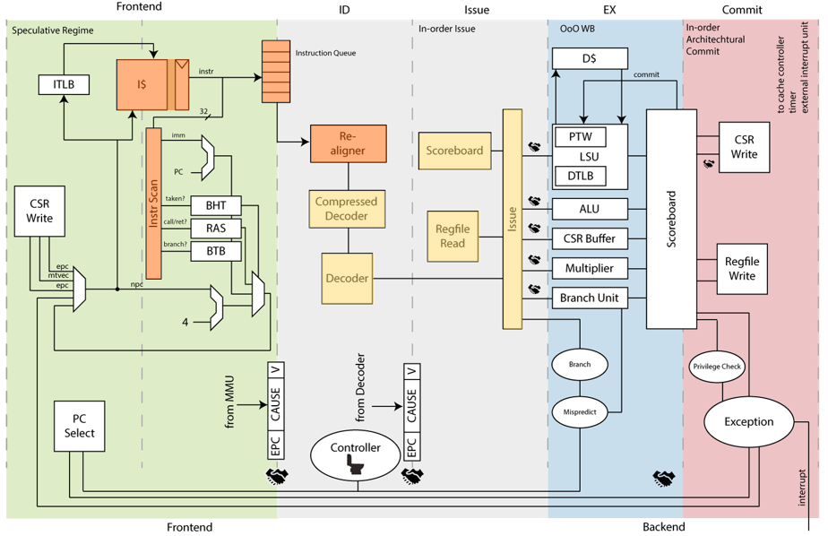

# Superscalar CVA6

# Project Launch Proposal

## Date of proposal - 2023-09-25

## Author(s) - Côme Allart

## Summary of project

### Components of the Project

#### Fetch 64 bits

Instruction cache fetches are currently 32-bit-long and 32-bit-aligned.
Instruction cache fetches will be made 64-bit-long and 64-bit-aligned.

#### Dual issue

The goal of this project is to issue up to two instructions each cycle.
This implies more operand reading from register bank, more data hazard
mitigation (including between the issue ports) and more operand forwarding.

#### Additional ALU

Structural hazards make it impossible to issue two instructions requiring the
exact same functional unit during the same cycle in an in-order processor.
To be able to issue two ALU instructions during the same cycle, we need to add
a second ALU.

The added ALU will be the same as the current CVA6 ALU.

## Summary of market or input requirements

As for the competition evolution, OpenHW Group should offer such a higher
performance core.

### Known market/project requirements at PL gate

The performance targer is +40% Coremark/MHz.

### Potential future enhancements for future project phases

#### Speculative scoreboard

Branch prediction currently has an impact on instruction fetch only.
Therefore, instructions following an unresolved branch are not issued.

It should be possible to change the issue stage and the branch functional unit
to issue speculative instructions.

The current estimations for this change are:

- performance:
  - Single issue: 3.23 CoreMark/MHz (+4.1%)
  - Dual issue: 4.85 CoreMark/MHz (+5.4%)
- area cost: 3 kGates (+2.3%)

#### ALU

After this performance project is completed, we may remove features from this
additional ALU to reduce area.

## Who would make use of OpenHW output

Everyone interested in implementing a fast CVA6.

Interested entities include:

- Thales
- Tristan project (EU)

## Summary of Timeline

The timeline is made of the several components in the pipeline order:

1. Fetch 64 bits (frontend): September 2023
2. Double-issue (issue stage): October 2023
3. Added ALU (EX stage): December 2023

## Explanation of why OpenHW should do this project

Improve CVA6 performance without impacting too much power/area.

## Industry landscape: description of competing, alternative, or related efforts in the industry

Competitive cores similar to CVA6 also increase performance by adopting dual issue.

## OpenHW Members/Participants committed to participate

Côme Allart, Thales DIS

## Project Leader(s)

### Technical Project Leader(s)

André Sintzoff, Thales DIS

### Project Manager, if a PM is designated

None

## Project Documents
### Project Planning Documents
### Project Output Documents

## List of project technical outputs

The project technical outputs will be provided as contributions to the CVA6
project with an opt-in configuration option to enable dual-issue.

The goal is not to reach TRL5 yet, but if the result of this project is good, it
will be ready to be verified by CVA6 project.

However the modifications must not impact single-issue CVA6 and the current test
suites must pass on double-issue CVA6.

### Feature Requirements

#### Fetch 64 bits

- Increasing the instruction cache port
- Requesting 64-bit aligned addresses
- Realigning up to 4 instructions instead of 2
- Scanning these 4 instructions
- Storing these 4 instructions into the instruction queue

#### Dual issue

- Adding a reading port to be able to pop up to 2 instructions from the instruction queue.
- Duplicate the decoder and the compressed decoder
- Duplicate the issue logic
  - Reading twice more operands from register bank
  - Checking for twice more data hazards, plus the potential data hazard between
    the two instructions issued the same cycle
  - Forwarding twice more operands from the executed but not yet committed
    instructions.
  - Inserting twice more entries into the scoreboard
  - Issuing more instructions to the functional units

#### Additional ALU

## External dependencies
## OpenHW TGs Involved

TWG Cores

## Resource Requirements

### Engineering resource supplied by members - requirement and availability

Côme Allart, Thales DIS

### OpenHW engineering staff resource plan: requirement and availability
### Marketing resource  - requirement and availability
### Funding for project aspects - requirement and availability

This activity is supported by the TRISTAN project, which receives funding from the Key Digital Technologies Joint Undertaking (KDT JU),  Austria, Belgium, Finland, France, Germany, Italy, the Netherlands, Poland, Romania, Switzerland and Turkey under grant agreement 101095947. The JU receives support from the European Union’s Horizon Europe research and innovation program.

## Architecture and/or context diagrams

## Project license model

As this project will be integrated to CVA6 repository, the chosen licence is SolderPad.

## Description of initial code contribution, if required
## Repository Requirements
## Project distribution model
## Preliminary Project plan

1. Fetch 64 bits (frontend): September 2023
2. Double-issue (issue stage): October 2023
3. Added ALU (EX stage): December 2023

## Risk Register

It is possible that the performance improvement resulting from this project be
lower than expected.

The expected performance from the model we built is used as a debugging
indicator: each of the three project phases have an expected performance gain so
that we can debug performance issues if we do not reach this gain.

So if the overall gain is lower than expected, we will debug both the RTL and
the model to understand the gap.
