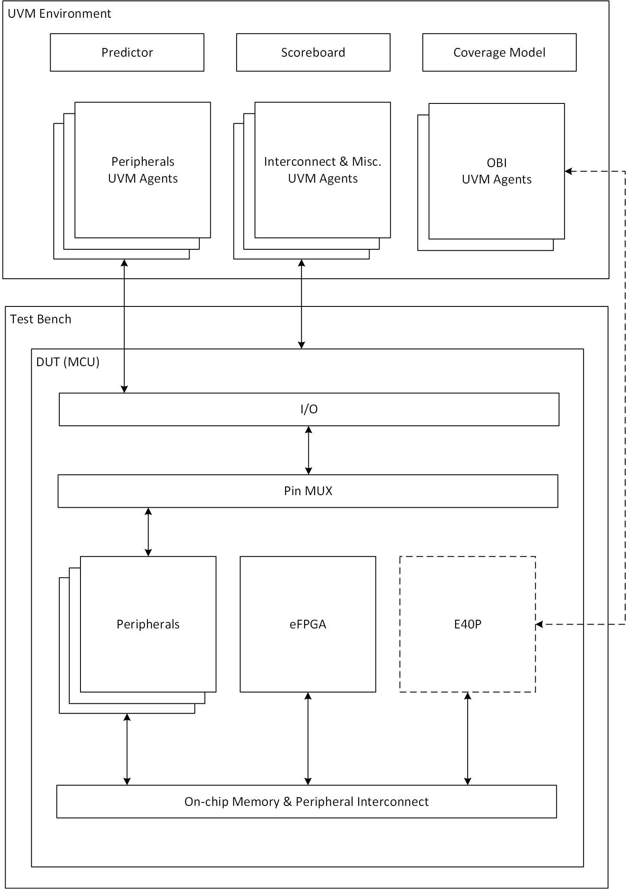

# Title of Project - "CORE-V MCU UVM Environment"
# Project Concept Proposal
## Date of proposal - 2022-01-24
## Author(s) - David Poulin

## High Level Summary of project, project components, and deliverables
Create a platform to attract existing, new and potential members of the OpenHW Group to participate in the development of an "Industrial Grade" verification environment for core-v-mcu.

The verification environment will follow the verification process developed for core-v-verif, including verification plans and the use of SV-UVM. This will produce an extensible UVM environment that can fully verify any single-core SoCs and as a result verify the core-v MCU to TRL-5 (production ready).

## Summary of market or input requirements

### Known market/project requirements at PC gate
* Develop an extensible UVM verification environment able to perform sequence-based, contrained-random verification
* Able to replace the core with a UVM agent to run stimulus and capable of running full verification of peripherals using UVM components for prediction and scoreboarding:
> * uDMA
> * SPI
> * QSPI
> * UART
> * I2C
> * JTAG
> * CPI
> * SDIO
* Ability to simulate and synthesize in Xilinx Vivado

### Potential future enhancements
* Ability to verify the embedded FPGA
* Ability to support integration of new peripherals for future versions of core-v MCU. Ex:
> * Ethernet MAC
> * Memory Controller
> * WiFi
> * Bluetooth
> * etc.

## Who would make use of OpenHW output
Companies or academic organizations wanting to create their own intermediate-scale, single core SoC/micro-controller.

## Initial Estimate of Timeline
6-9 months, depending on number of participants.

## Explanation of why OpenHW should do this project
CORE-V MCU would be the world's first, ready-to-implement TRL-5 SOC.

## Industry landscape: description of competing, alternative, or related efforts in the industry
No real competing product/project in the open source community.
Comparable in the commercial space would be the Arm® Cortex®-M0+ by ST Micro (https://www.st.com/content/st_com/en/arm-32-bit-microcontrollers/arm-cortex-m0-plus.html). From the STM32L0 Series.

## OpenHW Members/Participants committed to participate
* Datum

## Project Leader(s)
### Technical Project Leader(s)
### Project Manager, if a PM is designated
David Poulin

## Next steps/Investigation towards Project Launch (**PC only**)
* Get MCU stood up in a UVM Environment+Test bench in Vivado with RISC-V core
* Stub out the cv32e40p and replace with 2x OBI Memory Agents
* Re-create the ability to run the existing CORE-V MCU test suite with coverage enabled

### Target Date for PL
April 26th 2022

***Part 2, PL fields:***
*The PL proposal explains the "what". Some of it can be updated directly from the PC proposal* 

# Title of Project - "CORE-V CoresProject XYZ"
# Project Launch Proposal
## Date of proposal - 2021-01-01
## Author(s) - Joe Smith, Mary Jones

## Summary of project

### Components of the Project

*Components are major project components or groups of features.*
- *A project may have, for example, 1-10 components.*
- *Components detail the "The what" at high level, not detailed level*
- *Components don't consider timeline.*
- *For example* 
  - *Component 1 "Compiler changes for standard instructions."* 
  - *Component 2 "Compiler changes for custom instructions"* 
  - *Component 3 "Updates to compiler tools".*

#### Component 1 Description
#### Component 2 Description

## Summary of market or input requirements
### Known market/project requirements at PL gate
### Potential future enhancements for future project phases

## Who would make use of OpenHW output

## Summary of Timeline
*High level view of timeline, for example timeframe for each component*

## Explanation of why OpenHW should do this project
*What is the impact of doing/not doing this project on the OpenHW ecosystem. Why is OpenHW best suited to do this project*

## Industry landscape: description of competing, alternative, or related efforts in the industry

## OpenHW Members/Participants committed to participate

## Project Leader(s)
### Technical Project Leader(s)
### Project Manager, if a PM is designated

## Project Documents
### Project Planning Documents
### Project Output Documents

## List of project technical outputs
*This is a list of technical artifacts produced by the project*

### Feature Requirements
*Features are more granular than Components.* 
*For SW porting projects, this list serves as the detailed project reference for features*
*For IP Cores or more complext projects, a user manual with requirements specification is produced at the PA gate, which may supercede this list of features*

#### Feature 1
#### Feature 2

## External dependencies
*These are external factors on which the project depends, such as external standards ratification, external technology input, etc.*

## OpenHW TGs Involved
*Which TG will be involved, such as SW, HW, Verification, etc.*

## Resource Requirements
*This is a list of major resources/people required to implement the project and indication of whether the resources are available*

### Engineering resource supplied by members - requirement and availability
### OpenHW engineering staff resource plan: requirement and availability
### Marketing resource  - requirement and availability
### Funding for project aspects - requirement and availability 

## Architecture and/or context diagrams 
*Architecture (internal blocks and interconnections), and context (depiction of the the project content within its operational context), are both encouraged where appropriate to depict functionality to both subject matter experts and to non-experts*

## Project license model

## Description of initial code contribution, if required

## Repository Requirements

## Project distribution model

## Preliminary Project plan
*A full project plan is not required at PL. A preliminary plan, which can be for instance the schedule for completion of component or feature list, together with responsible resource, should be provided. Full details should be provided at PA gate.*

## Risk Register
*A list of known risks, for example external dependencies, and any mitigation strategy*

